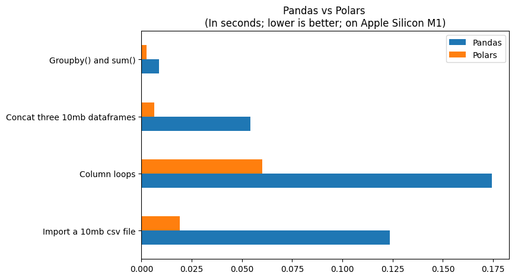
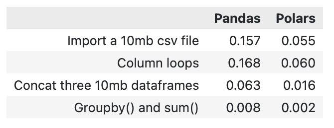

[Polars](https://pola.rs/) is an alternative to [Pandas](https://pandas.pydata.org/) that I've heard about but never actually used. According to itself, it is a "blazingly fast DataFrames" - can you believe that?

In this article, I tested it in my own common environment, and it's **really fast.**

# Test Results

The bar chart shows that Polars takes 1/4 or even less time than Pandas for common operations:



Detailed table:


# Test Method

## Environment

- Apple Silicon M1 (2020, the cheapest one)
- MacOS 13
- Jupyter Notebook in VSCode
- Python ==3.10.9
- pandas==1.5.3
- polars==0.16.6

## Tasks

1. Import a 10MB csv file with spe & encoding, which is a very common task

   ```
   df_pd = pd.read_csv('./data/hotel_train.txt', sep=',', encoding='utf-8')
   df_pl = pl.read_csv('./data/hotel_train.txt', sep=',', encoding='utf-8')

   ```
2. Concatenate repeated dfs into one

   ```
   pd.concat([df_pd, df_pd, df_pd])
   pl.concat([df_pl, df_pl, df_pl])

   ```
3. Simple statistical operations of groupby and sum

   ```
   df_pd.groupby('hotel').sum()
   df_pl.groupby('hotel').sum()

   ```
4. Loop statistical operations of groupby and sum according to each column name

   ```
   for col in df_pd.columns:
       df_pd.groupby(col).sum()
   for col in df_pl.columns:
       df_pl.groupby(col).sum()

   ```

Detailed test data and code: [https://github.com/reycn/polars-pandas-bench](https://github.com/reycn/polars-pandas-bench)

# References

1. Test dataset: [https://www.kaggle.com/datasets/jessemostipak/hotel-booking-demand](https://www.kaggle.com/datasets/jessemostipak/hotel-booking-demand)
2. Test data and code: [https://github.com/reycn/polars-pandas-bench](https://github.com/reycn/polars-pandas-bench)
3. Someone else's large-scale test: [https://h2oai.github.io/db-benchmark/](https://h2oai.github.io/db-benchmark/)
4. Polars open source repository: [https://github.com/pola-rs/polars](https://github.com/pola-rs/polars)

[用中文阅读](https://quoth.win/substitute-pandas-with-polars-a-dataframe-module-rewritten-in-rust)
